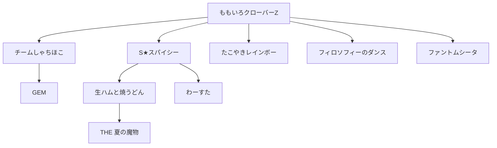

# みゃみゅ玉子

**みゃみゅ玉子** は、和歌山のVTuber、ITエンジニア、eスポーツイベント手伝い、殿の家来、ドルヲタ、ゲーマー。
「たまごさん」「みゃみゅちゃん」と呼ばれることが多く、「みゃみゅ玉子さん」とフルで呼んでくれる人は少ない。
VTuberとしてのキャラクターデザインは自分自身の特徴から作っている。

## 人物・概要

誕生日は3月23日。身長は175cmでVTuberとしてのキャラクターもそのサイズで作成している。
血液型はＯ型で、ほぼ100％の確率で当てられる。

おもしろそう・楽しそうと思うところに全力疾走する癖があり、その勢いからグループ内の重要な役割を与えられることもある。
少しの責任感と飽きっぽい性格が常に戦っていて、モチベーション管理で疲弊していることも珍しくはない。

主な活動は、VTuberとしては [Twitchでのライブ配信](https://www.twitch.tv/myamyu) や [ポッドキャスト](https://listen.style/p/myamyu_ai_radio)。
eスポーツイベントの手伝いは主に土日祝日で、基本的には機材の設置や来場者の案内がメイン。たまに試合の実況もさせてもらっている。

アニメやマンガも人並みに嗜んでいる。  
参考:
- [おすすめしたいアニメ](https://scrapbox.io/myamyu/%E3%81%8A%E3%81%99%E3%81%99%E3%82%81%E3%81%97%E3%81%9F%E3%81%84%E3%82%A2%E3%83%8B%E3%83%A1)
- [おすすめしたいマンガ](https://scrapbox.io/myamyu/%E3%81%8A%E3%81%99%E3%81%99%E3%82%81%E3%81%97%E3%81%9F%E3%81%84%E6%BC%AB%E7%94%BB)

### ITエンジニアとして

スタンディングデスクを好み、1日中立って仕事をしている。  
なるべく小さめのキーボードを好み、Corne Cherryを愛用している。  
トラックボールやタッチパッド等を使っていたが、ゲーミングマウスに落ち着く。

WindowsアプリケーションでVisual Basic、C#などを経験した後、WebアプリケーションでJava、Python、Java Script、Go等を書くようになる。  
Google Cloud上での開発も行っている。

仕事ではAIとケンカをしているが、プライベートでは仲が良い。

### ドルヲタとして

2012年にももいろクローバー（現在は、ももいろクローバーZ）にハマり、スターダストのアイドルを中心に推し増しをしている。

どこをきっかけにどこにハマったかの関連図:

### ゲーマーとして

小さな頃からよくゲームをしていた。  
RPGがメインだったが、大人になるにつれて長い時間かけるゲームに手が伸びなくなる。

ゲームセンターでは縦スクロールのシューティングゲームやガンシューティングゲームを好んでプレイをしていた。

駄菓子屋にあったストリートファイター2をきっかけに格闘ゲームをはじめる。  
好きな格闘ゲームはヴァンパイアシリーズで、レイレイ、フォボス、Q-Beeなどを使う。

愛用コントローラーはRushBox。Steamの音ゲーにも使用する。

#### 格闘ゲーム 使用キャラクター

| ゲームタイトル | 使用キャラクター | 備考 |
|---|---|---|
|ストリートファイター 2| ガイル、ブランカ | 波動拳むずかしいからガイルがいいよと友人に勧められて |
|ストリートファイター 6| リリー、エレナ、ザンギエフ | |
|ヴァンパイア| モリガン | |
|ヴァンパイア・ハンター| レイレイ、フォボス | |
|ヴァンパイアセイヴァー| レイレイ、Q-Bee | |
|KOFシリーズ| 麻宮アテナ、不知火舞、キング、ユリ・サカザキ、椎拳崇 | アテナがメイン |
|餓狼伝説| アンディ・ボガード | |
|餓狼伝説 2| アンディ・ボガード | |
|餓狼伝説 3| ジョー・東 | |
|餓狼伝説 City of the Wolves| プリチャ、B.ジェニー | |
|鉄拳 8| パンダ、ミアリズ、吉光 | |
|バーチャファイター 2| パイ・チェン | |
|バーチャファイター 3| パイ・チェン | |
|バーチャファイター 5 R.E.V.O. | アイリーン | |
|GUILTY GEAR -STRIVE-| ベッドマン？、ラムレザル | |
|Granblue Fantasy Versus: Rising| ヴィーラ、ガレヲン | |
|MARVEL Tōkon: Fighting Souls| ミズ・マーベル、ロキ、デンジャー、ペニー・パーカー | ミズ・マーベルがメイン |

## 経歴

東京都出身（と本人は言い張っているが、生まれたのは市川）で、茨城県で育つ。  
茨城県、東京都と関東地方を中心に仕事をしているが、結婚をきっかけに和歌山に拠点を移す。

ストリートファイター6をきっかけに様々なVTuberを見るようになり、「この辺のご当地VTuberは？」と探していて[がおりん](https://x.com/gao_rin_V)（通称 殿）に出会う。  
その後、がおりんの運営と親しくなり、地元のeスポーツチームである[和歌山インダミタブルパンダ](https://wip-wakayama.com)（通称 WIP）や[和歌山eスポーツ連合](https://www.wakayama.games)（WeSU）の手伝いをするようになる。

殿の配信を見ていて「VTuberってどういう環境を用意すればできるのだろう？」と思い、環境を整え始めるところからみゃみゅ玉子のVTuberとしての活動が始まる。
**「殿が配信まわりで困ったときの手助けができるように」** という考えもあることから「和歌山を応援しているVTuberを応援している家来系VTuber」を名乗ることとなった。

配信をしていくうちに **もっと喋れるようになりたい** と思うようになり、2026年にポッドキャスト[殿の寝静まるそのあとに、家来はちょいと語りに入る](https://youtube.com/playlist?list=PLYNyI4-wKWePTWvhIgeZSxF8oljAfjEIO&si=_OzMtFWChpeCeYyG)を始める。  
おたよりを読み上げて話す形式を採用するためにAIにおたよりを生成させる方式を取り、 **「いつか、リスナーから本当におたよりが届くといいな」** と思いながら毎週収録をしている。

## VTuberの活動

- 火曜日： **Twitchで定例配信** 21:30頃開始を目指している
  - [Twitch(myamyu)](https://www.twitch.tv/myamyu)
  - 配信の記録やショート動画は [Youtubeチャンネル](https://www.youtube.com/@%E3%81%BF%E3%82%83%E3%81%BF%E3%82%85%E7%8E%89%E5%AD%90_%E6%AE%BF%E3%81%AE%E5%AE%B6%E6%9D%A5Vtuber)で見れる
- 水曜日：**podcast 「殿の寝静まるそのあとで、家来はちょいと語りに入る」更新**  
  - [Listen](https://listen.style/p/myamyu_ai_radio): 文字起こし性能が良いので読みながらでも聴ける
  - [Youtube](https://youtube.com/playlist?list=PLYNyI4-wKWePTWvhIgeZSxF8oljAfjEIO&si=_OzMtFWChpeCeYyG): 動画で見れる
